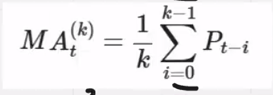

# Class 02 — Notes

**Date:** 2026-08-26
**Topic:** Precios vs. Retornos — parte 2 de 2, continúa de class-01 _(comenzamos desde el punto 11 del notebook)_

## Key concepts

- **Retornos**: fórmula de retorno simple.
- **Media móvil (SMA — Simple Moving Average)**
  - Es un indicador **descriptivo**, no predictivo — sirve para ver tendencias, no para anticiparlas.
  - SMA(20): pensado para tendencias de corto plazo.
  - 
- **Señales a partir del SMA**
  - Lógica simple: el precio está por encima, por debajo, o en el SMA.
  - Se analiza la curva acumulativa de esa señal para ver el rendimiento.
  - 
- **Retorno de estrategia** (`Signal.shift(1) * Return`): la señal de *ayer* define la posición de *hoy*, para evitar look-ahead bias.
  - `Strategy_Return` = retorno diario (día a día, no dice nada del acumulado).
  - `cumprod()` sobre `1 + Strategy_Return` = curva de crecimiento acumulado (cuánto vale mi capital a lo largo del tiempo).

## Code / examples covered in class
- Cómo graficar un SMA.
- Cómo crear señales a partir del SMA con la lógica sugerida.
- Cómo calcular el retorno de estrategia y su crecimiento acumulado (sección 15 del notebook).

## My questions / things to review
- **P:** En el área corporativa, ¿se sigue usando `yfinance` o existen bibliotecas mejores?
  **R:** En el mercado se usan servicios corporativos, donde se compran datos.
- ~~Revisar la sección 15, entender mejor el rendimiento de estrategias~~ — resuelto: diferencia entre retorno diario (`Strategy_Return`) y retorno acumulado (`cumprod`), y por qué se usa `.shift(1)` para evitar look-ahead bias.

## Resources
- Slides and images: see `resources/`
- Shared notebook (sesiones 1 y 2): `../resources/Sesion1_2.ipynb`

