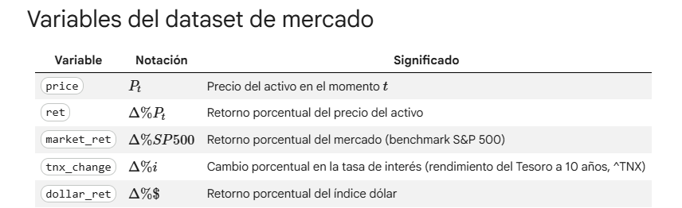
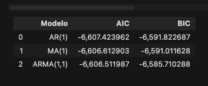
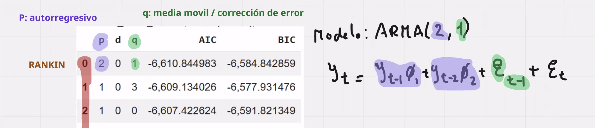
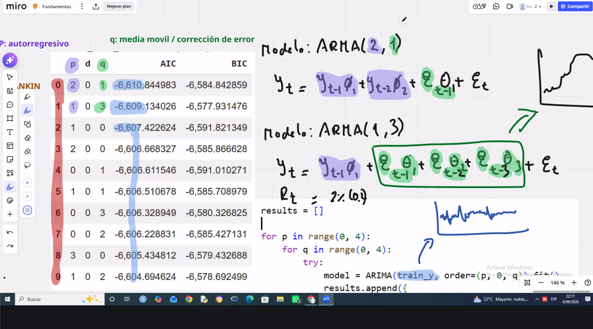
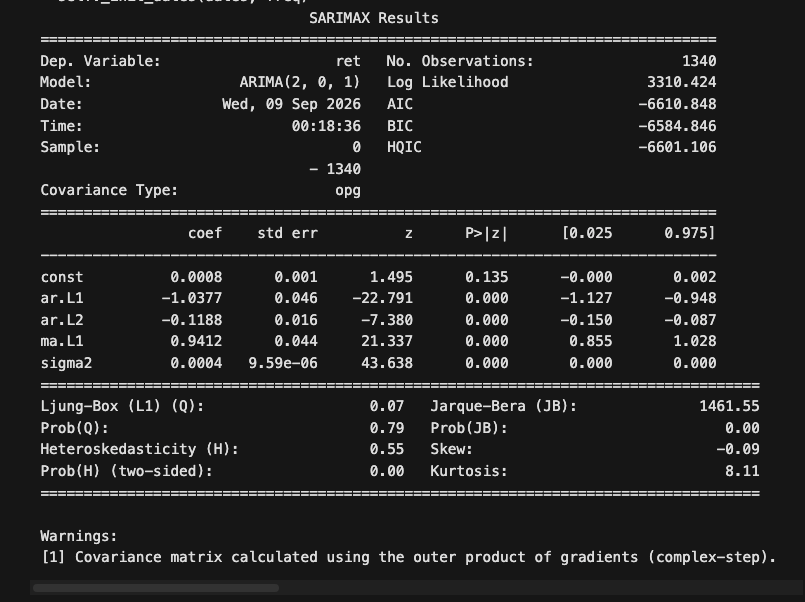
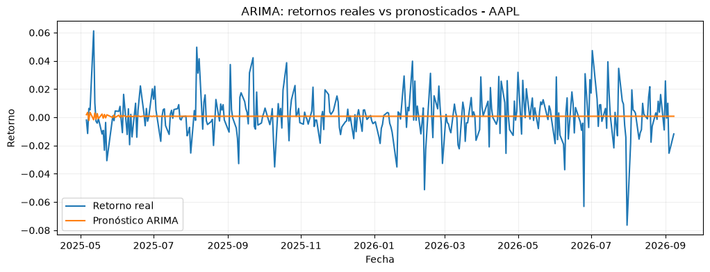

# Class 05 — Notes

**Date:** 2026-09-08
**Topic:** Series de tiempo financieras con Python y `yfinance` — de AR/MA/ARMA a ARIMA/ARIMAX

## Key concepts

- **Dataset de mercado**: variables usadas en los modelos de esta clase.
  - 
- **Estacionariedad**
  - Estacionaria: se mantiene dentro de una banda/rango estable en el tiempo.
  - No estacionaria: se mueve de forma libre, sube y baja sin un rango fijo.
  - Se evalúa con el **test de Dickey-Fuller (ADF)**: el p-value indica la probabilidad de que la interpretación (estacionaria o no) sea correcta.
- **Raíz unitaria**
  - Idea intuitiva: si para estimar el precio de mañana la mejor referencia es el precio de hoy, la serie tiene raíz unitaria.
  - En fórmula: $P(t+1) = f(P(t))$.
  - Consecuencia práctica: un modelo ARIMA sobre una serie con raíz unitaria fuerte tiende a proyectar casi una línea recta (repite el último valor conocido), porque no hay estructura adicional que explotar.
- **ACF y PACF** (analogía del profesor: como ajustar los graves y los agudos de una señal)
  - Sirven para ver si el precio de un día tiene relación con el precio de otro día, por ejemplo si el precio de ayer influye en el de hoy.
  - **ACF**: es básicamente la $r$ de correlación de Pearson entre la serie y su versión rezagada.
  - **PACF**: similar, pero parcial. Mide la relación entre el rezago $t-k$ (ej. $t-6$) y el valor actual, excluyendo el efecto de los rezagos intermedios ($t-1, t-2, t-3, t-4, t-5$).
- **AR, MA y ARMA: selección de modelo con AIC/BIC**
  - El AIC y el BIC crecen según la complejidad del modelo y bajan según el error. Entre modelos candidatos, gana el de **menor AIC**.
  - En la comparación de la clase, AR(1) tuvo el menor AIC (no por mucho, pero fue el mejor):
    
- **Parámetros $(p, d, q)$ de ARIMA**
  - $p$: autorregresivo, número de rezagos del valor de la serie.
  - $d$: diferenciación (ej. $d=1$ usa el precio de ayer como referencia).
  - $q$: media móvil, pero de corrección de error, no de rezagos del valor. Ejemplo del profesor: si el modelo predice que sube pero en realidad baja, esa corrección es la $q$.
  - Ejemplo con el modelo ARMA(2,1): $y_t = \phi_1 y_{t-1} + \phi_2 y_{t-2} + \theta \varepsilon_{t-1} + \varepsilon_t$ (los pesos $\phi$ y $\theta$ no estaban escritos en la imagen original, pero también los lleva):
    
  - Búsqueda de la mejor combinación $(p, q)$ por fuerza bruta, comparando AIC de cada par (tabla de ranking + loop `for p / for q` ajustando `ARIMA(train_y, order=(p, 0, q))`):
    
  - Modelo final elegido: **ARMA(2,0,1)** (resultado de `SARIMAXResults` sobre la serie de retornos, AIC = -6610.848, coeficientes AR y MA significativos).
    - La constante (`const`) no aparece en la fórmula escrita a mano, pero equivale al valor medio constante que se asume para el proceso (suele ser positiva).
    - `sigma2` es la varianza de los residuos del modelo (su variabilidad).
    
  - **Conclusión sobre ARIMA** (hasta este punto de la clase, sigue en curso): el pronóstico prácticamente no se movió (línea casi plana), coherente con la raíz unitaria que vimos antes. Igual se enseña porque es el primer paso para entender modelos más avanzados.
    
- **ARIMAX**
  - Extiende ARIMA incorporando variables exógenas (datos de otros activos/factores relacionados), lo que permite un forecasting mejor y no solo una línea recta como con ARIMA puro.

## Code / examples covered in class
- Función `stationarity_tests()`: corre ADF y KPSS juntos sobre una serie e interpreta el resultado contra la $H_0$ de cada test.
- ACF y PACF sobre los retornos, para orientar los parámetros $p$ (AR) y $q$ (MA) antes de ajustar ARIMA.
- Búsqueda por fuerza bruta de $(p, q)$: doble loop ajustando `ARIMA(train_y, order=(p, 0, q))` para cada combinación y comparando AIC.

## My questions / things to review
- **P:** ¿Qué significa que una serie sea estacionaria o no?
  **R:** Estacionaria se mantiene en una banda; no estacionaria se mueve sin rango fijo. Se determina con el p-value del test de Dickey-Fuller (ADF).
- **P:** ¿Qué quiere decir raíz unitaria?
  **R:** Que el mejor predictor del valor de mañana es el valor de hoy, $P(t+1) = f(P(t))$. Por eso un ARIMA sobre una serie con raíz unitaria fuerte tiende a proyectar una línea recta.
- **P:** (preguntado en la sala) Para ARIMAX, ¿cómo sé qué datos agregar al forecasting?
  **R:** Conociendo la empresa, qué otras empresas son parecidas o tienen relación con ella. Ejemplo con Apple: el S&P 500, NVDA, TSLA, y similares.
- **P:** ¿Qué son MAE y RMSE?
  **R:** No es el valor máximo absoluto. El **MAE** (Mean Absolute Error) es el promedio de los errores en valor absoluto: $\frac{1}{n}\sum |y_i - \hat{y}_i|$. El **RMSE** (Root Mean Squared Error) es la raíz cuadrada del promedio de los errores al cuadrado: $\sqrt{\frac{1}{n}\sum (y_i - \hat{y}_i)^2}$, se divide por $n$ (cantidad de observaciones), no por $m$. El RMSE penaliza más los errores grandes que el MAE, por elevarlos al cuadrado.

## Update (2026-09-10) — error por actualización de paquetes

Actualicé `pandas`, `numpy`, `scikit-learn`, `yfinance` y `statsmodels` (0.14.6 → 0.15.0) en mi venv local, porque el profesor tuvo un error en Colab con una fecha rara y sospechábamos que era por una librería actualizada.

- **Causa raíz**: `statsmodels >= 0.15` ya no tolera un `DatetimeIndex` sin frecuencia asignada al llamar `.forecast()`/`.get_forecast()` — antes (0.14) solo tiraba un warning y seguía funcionando con un fallback; ahora tira `ValueError: No supported index is available` directo. El índice que entrega `yfinance` nunca tiene frecuencia (por los fines de semana/feriados sin filas).
- **Fix aplicado en 3 lugares del notebook** (secciones 12, 15 y 19 — ARIMA, ARIMAX, y ARIMAX con rezagos): resetear el índice de `train_y`/`train_X` a un `RangeIndex` antes de ajustar el modelo, y reasignar las fechas reales de `test_y` recién al resultado del pronóstico. Para el `exog` (ARIMAX), además hay que hacer que `test_X` continúe la numeración justo donde termina `train_X`, si no `SARIMAX` tira otro error (`"The indices for endog and exog are not aligned"`) porque `endog` y `exog` quedan con índices de tipos distintos.
- **Alternativa que usó el profesor**: `train_y.asfreq('D')` — asignarle una frecuencia diaria calendario al índice en vez de sacarle las fechas. Funciona, pero introduce `NaN` en los fines de semana (statsmodels los tolera vía Kalman filter, pero mezcla "no hubo mercado" con "dato faltante").

**Resultados finales** (AAPL, split 80/20, mismo `(p,0,q)` elegido por AIC):

| Modelo | MAE | RMSE |
|---|---|---|
| ARIMA | 0.0110 | 0.0157 |
| ARIMAX (con X contemporáneas) | 0.0103 | 0.0145 |
| ARIMAX con X rezagadas (más realista) | 0.0113 | 0.0159 |

ARIMAX con X contemporáneas dio el mejor resultado, pero es un poco "trampa" — usa datos del mismo día que en un pronóstico real todavía no conocerías. La versión con rezagos es la comparación honesta, y da un poco peor que el ARIMA simple, lo cual también es un resultado válido para discutir en clase.

## Resources
- Slides: see `resources/`
- Notebook de la clase: `Sesion_5 (1).ipynb`

